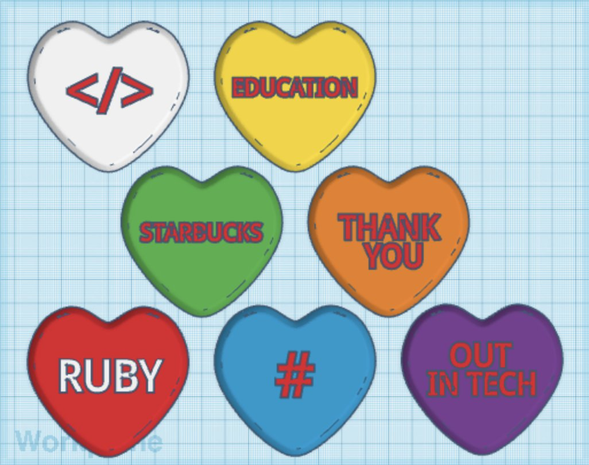

# 3D_Printed_Candy_Hearts

Overview: Candy hearts are a Valentine's Day staple piece. Originally this project was conducted on TinkerCAD upon remixing some else's project. The candy hearts were intended to be magnets and meant to be gifted. Fast-forwarding to a few months later, I discovered OpenSCAD. OpenSCAD is software for creating 3D models with a few lines of code. In the 3D_Printed_Candy_Hearts projects, I decided to recreate the candy hearts but this time with OpenSCAD to explore the intersection of 3D printing and programming.

TinkerCAD Candy Heart Set: https://www.tinkercad.com/things/6lZI4ldRflN

